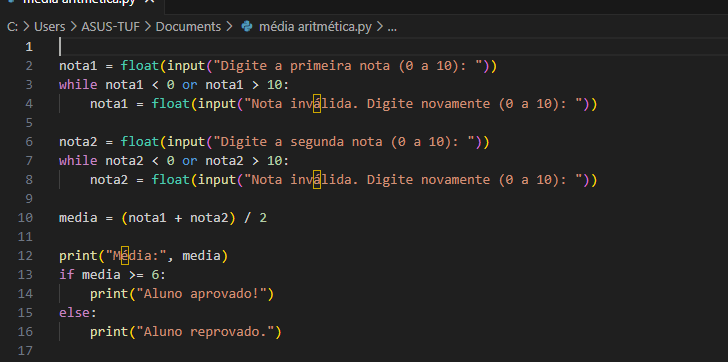

# Estrutura de decisão e repetição no python
Atividades das aulas de Programação

1 - Números pares de 0 a 30 (exceto 10, 20 e 30):

Utiliza for e continue.

Exibe apenas os números pares, pulando os especificados.

Visualização prévia do código logo abaixo:

2 - Média de duas notas com validação:

Solicita duas notas entre 0 e 10.

Usa while para garantir que as notas estejam no intervalo correto.

Calcula a média e informa se o aluno foi aprovado (média ≥ 6) ou reprovado.

Visualização prévia do código logo abaixo:

